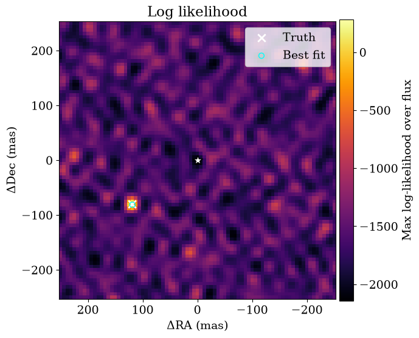
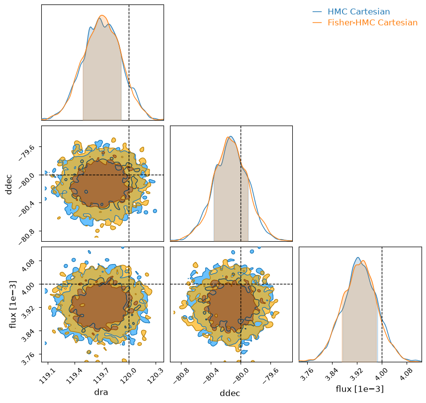
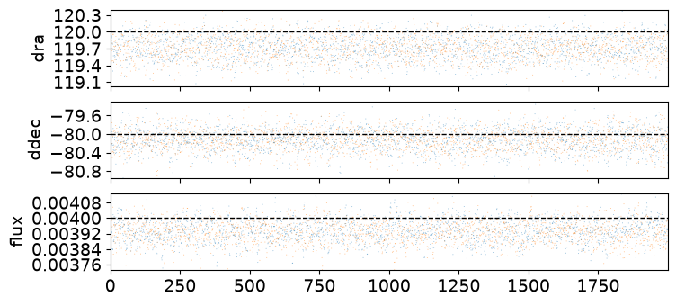
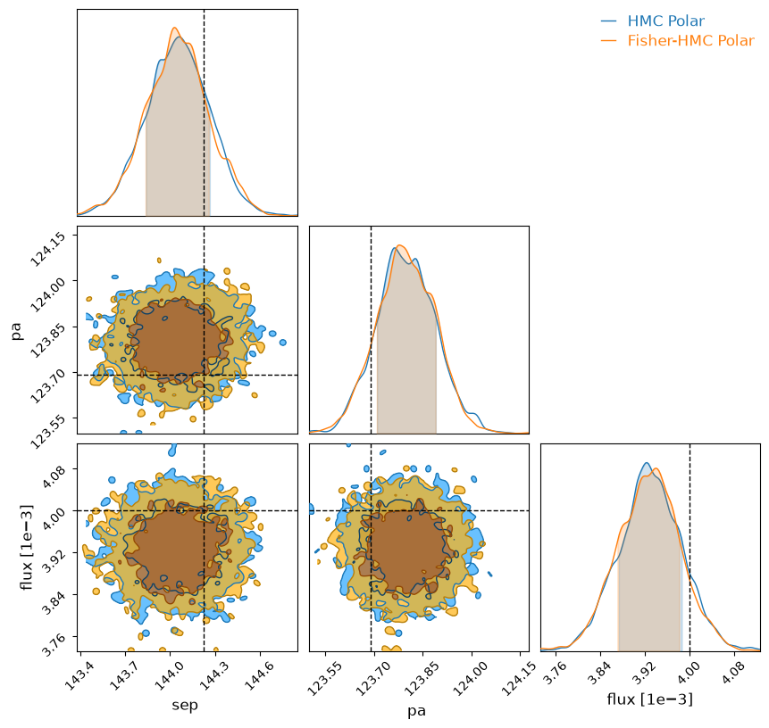
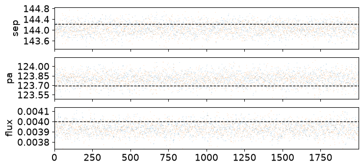
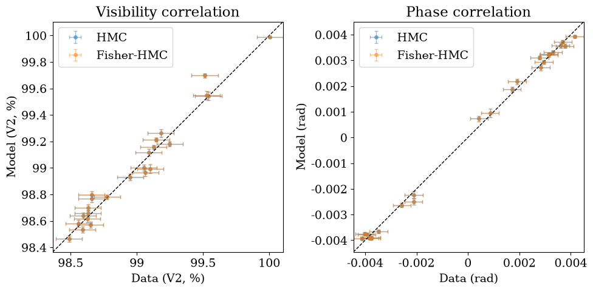

<!-- AUTO-GENERATED FROM notebooks/binary_search.ipynb by scripts/sync_tutorial_docs.py. -->
# Binary recovery with grid search and HMC

The first and simplest thing you will want to do in a lot of interferometric datasets is to look for faint companions at high resolution: this is often why we're in the game in the first place!

This tutorial walks through end-to-end binary recovery on synthetic interferometric observables, starting from a coarse likelihood grid and continuing through vanilla HMC and Fisher-reparameterized HMC.

First, let's import everything we will need.

```python
import warnings
import jax
import jax.numpy as jnp
import numpy as onp
import matplotlib.pyplot as plt
from jax.flatten_util import ravel_pytree

warnings.filterwarnings("ignore", message="IProgress not found.*")

import numpyro
import numpyro.distributions as dist
from numpyro.infer import MCMC, NUTS
from numpyro.infer.initialization import init_to_value

from virgil.grid_fit import likelihood_grid
from virgil.inference import fisher_projection, hessian_matrix
from virgil.likelihood import loglike, posterior_predictive_summary
from virgil.models import BinaryModelCartesian
from virgil.oidata import OIData
from virgil.plotting import (
    set_style,
    plot_data_model_correlation,
    plot_grid_map,
    plot_chainconsumer_diagnostics,
    diagnostics_table_from_samples,
    truth_cartesian_and_polar,
)

set_style()  # the figure style used throughout the docs
```

## Simulate Data

We're going simulate $V^2$ and phase observables from a known binary model, add realistic noise, and wrap this into the `OIData` object that `virgil` uses to handle data.

```python
rng = onp.random.default_rng(42)
n_bl = 24
u = jnp.array(rng.uniform(-28.0, 28.0, size=n_bl))
v = jnp.array(rng.uniform(-28.0, 28.0, size=n_bl))
wavel = jnp.array([4.8e-6])

truth = {"dra": 120.0, "ddec": -80.0, "flux": 4e-3}
model_true = BinaryModelCartesian(**truth)
cvis_true = model_true.model(u, v, wavel)

vis_true = jnp.abs(cvis_true) ** 2
phi_true = jnp.rad2deg(jnp.angle(cvis_true))

# Synthetic noise as percentage of data scale (phase in degrees), boosted SNR by 5x.
vis_scale = jnp.maximum(jnp.median(vis_true), 1e-6)
phi_scale = jnp.maximum(jnp.median(jnp.abs(phi_true)), 5.0)
d_vis = 0.001 * vis_scale * jnp.ones_like(vis_true)
d_phi = 0.004 * phi_scale * jnp.ones_like(phi_true)

vis_obs = vis_true + d_vis * jnp.array(rng.normal(size=vis_true.shape))
phi_obs = phi_true + d_phi * jnp.array(rng.normal(size=phi_true.shape))

data = OIData(
    {
        "u": u,
        "v": v,
        "wavel": wavel,
        "vis": vis_obs,
        "d_vis": d_vis,
        "phi": phi_obs,
        "d_phi": d_phi,
        "phi_unit": "deg",
        "i_cps1": None,
        "i_cps2": None,
        "i_cps3": None,
        "v2_flag": True,
        "cp_flag": False,
    }
)
```

## Grid Search for Companions

Because Jax is so fast and parallelizes so well, we can run very efficient grid searches compared to previous implementations. This is often the first place you will want to start in searching for a companion.

First we have to define our grid dictionary `samples` in our chosen coordinates - we will use Cartesian $(\Delta\mathrm{RA}, \Delta\mathrm{Dec}, \mathrm{flux})$ but you can just as well use polar coordinates in separation, position angle, and flux if you use `BinaryModelAngular` instead.

```python
samples = {
    "dra": jnp.linspace(-250.0, 250.0, 81),
    "ddec": jnp.linspace(-250.0, 250.0, 81),
    "flux": 10 ** jnp.linspace(-4.5, -1.5, 60),
}

ll_cube = likelihood_grid(BinaryModelCartesian, data, samples)
max_idx = jnp.unravel_index(jnp.argmax(ll_cube), ll_cube.shape)
grid_est = {
    "dra": float(samples["dra"][max_idx[0]]),
    "ddec": float(samples["ddec"][max_idx[1]]),
    "flux": float(samples["flux"][max_idx[2]]),
}

print(
    "Grid estimate: dra={:.3g} mas, ddec={:.3g} mas, flux={:.2g}".format(
        grid_est["dra"], grid_est["ddec"], grid_est["flux"]
    )
)
```

```text
Grid estimate: dra=119 mas, ddec=-81.2 mas, flux=0.0038
```

## Visualize the Grid
We have plotting helpers to achieve a consistent style and handle metadata: we'll see that the binary is very accurately recovered just from this grid search!

How significant is the best grid point? Answering that needs the distribution of the search's best statistic under noise alone, which [Detection ROC curves](detection_roc.md) simulates.

```python
# The full grid is reduced to the maximum log likelihood over flux at each
# (dra, ddec).
plot_grid_map(
    ll_cube,
    samples,
    truth=truth,
    best=grid_est,
    label="Max log-likelihood over flux",
);
```



## Uncertainty quantification with Hamiltonian Monte Carlo

You may have used MCMC before, for example with [Metropolis-Hastings](https://en.wikipedia.org/wiki/Metropolis%E2%80%93Hastings_algorithm) or [`emcee`](http://emcee.readthedocs.io/), but these will often perform poorly in high dimensions. Because we're using Jax and have gradients, we can use [Hamiltonian Monte Carlo](https://arxiv.org/abs/1701.02434), which can work in arbitrarily high dimensions. We will use [`numpyro`](https://num.pyro.ai/en/stable/) to handle this:

```python
params = ["dra", "ddec", "flux"]


# Define a simple physical-parameter HMC model with bounded priors.
def model_hmc(oidata):
    dra = numpyro.sample("dra", dist.Uniform(-300.0, 300.0))
    ddec = numpyro.sample("ddec", dist.Uniform(-300.0, 300.0))
    log10_flux = numpyro.sample("log10_flux", dist.Uniform(-6.0, -1.0))
    flux = 10.0**log10_flux
    ll = loglike([dra, ddec, flux], params, BinaryModelCartesian, oidata)
    numpyro.factor("loglike", ll)


# Initialize near the grid maximum for robust convergence in this toy setup.
init_values = {
    "dra": float(grid_est["dra"]),
    "ddec": float(grid_est["ddec"]),
    "log10_flux": float(jnp.log10(max(grid_est["flux"], 1e-12))),
}
kernel = NUTS(model_hmc, init_strategy=init_to_value(values=init_values))
mcmc = MCMC(
    kernel, num_warmup=800, num_samples=2000, num_chains=1, progress_bar=False
)
mcmc.run(jax.random.PRNGKey(2026), oidata=data)
posterior = mcmc.get_samples()

summary = {
    "dra_median": float(jnp.median(posterior["dra"])),
    "ddec_median": float(jnp.median(posterior["ddec"])),
    "flux_median": float(jnp.median(10.0 ** posterior["log10_flux"])),
}
print(
    "HMC estimate: dra={:.3g} mas, ddec={:.3g} mas, flux={:.2g}".format(
        summary["dra_median"], summary["ddec_median"], summary["flux_median"]
    )
)
```

```text
HMC estimate: dra=120 mas, ddec=-80.1 mas, flux=0.0039
```

## Diagnostic Tables
We have helper functions to reformat the posterior draws into a dataframe.

```python
# Convert vanilla posterior samples into diagnostics table for later comparison plots.
hmc_results = diagnostics_table_from_samples(
    posterior,
    flux_key="log10_flux",
    log10_flux=True,
)

print(
    "HMC estimate from diagnostics table: dra={:.3g} mas, ddec={:.3g} mas, flux={:.2g}".format(
        float(hmc_results["dra"].median()),
        float(hmc_results["ddec"].median()),
        float(hmc_results["flux"].median()),
    )
)
```

```text
HMC estimate from diagnostics table: dra=120 mas, ddec=-80.1 mas, flux=0.0039
```

## Fisher Reparametrization
If you are finding that HMC is failing to converge quickly on high-SNR data, it can be because the posteriors are often highly correlated between parameters. The good thing is that [`zodiax`](https://github.com/LouisDesdoigts/zodiax), the backend of `virgil`, has helper functions to reparametrize problems into their natural scales, parametrized by a fiducial value for all parameters `x0` and the [Fisher Information Matrix](https://en.wikipedia.org/wiki/Fisher_information).

See [this `zodiax` tutorial](https://github.com/LouisDesdoigts/zodiax_tutorials/blob/main/optimisation_tools.ipynb) for more information!

```python
x0_dict = {
    "dra": grid_est["dra"],
    "ddec": grid_est["ddec"],
    "log10_flux": float(jnp.log10(max(grid_est["flux"], 1e-12))),
}
x0, unravel = ravel_pytree(x0_dict)


# Build local Fisher geometry around x0 for whitening transform.
def objective(x):
    xdict = unravel(x)
    flux = 10.0 ** xdict["log10_flux"]
    values = jnp.array([xdict["dra"], xdict["ddec"], flux])
    return -loglike(values, params, BinaryModelCartesian, data)


F = hessian_matrix(objective, x0)
P = fisher_projection(F)


# Sample in latent coordinates and apply explicit prior correction back to physical priors.
def model_hmc_fisher(oidata):
    u_latent = numpyro.sample(
        "u", dist.Normal(0.0, 1.0).expand([x0.shape[0]]).to_event(1)
    )
    log_q_u = dist.Normal(0.0, 1.0).log_prob(u_latent).sum()
    x = x0 + jnp.dot(
        P, u_latent
    )  # this maps it to the original physical space
    xdict = unravel(x)
    dra = xdict["dra"]
    ddec = xdict["ddec"]
    log10_flux = xdict["log10_flux"]
    flux = 10.0**log10_flux
    numpyro.deterministic("dra", dra)
    numpyro.deterministic("ddec", ddec)
    numpyro.deterministic("flux", flux)
    log_prior_x = (
        dist.Uniform(-300.0, 300.0).log_prob(dra)
        + dist.Uniform(-300.0, 300.0).log_prob(ddec)
        + dist.Uniform(-6.0, -1.0).log_prob(log10_flux)
    )
    numpyro.factor("prior_correction", log_prior_x - log_q_u)
    numpyro.factor(
        "loglike",
        loglike([dra, ddec, flux], params, BinaryModelCartesian, oidata),
    )


kernel_f = NUTS(model_hmc_fisher)
mcmc_f = MCMC(
    kernel_f,
    num_warmup=800,
    num_samples=2000,
    num_chains=1,
    progress_bar=False,
)
mcmc_f.run(jax.random.PRNGKey(2027), oidata=data)
post_f = mcmc_f.get_samples()


print(
    "Fisher HMC estimate: dra={:.3g} mas, ddec={:.3g} mas, flux={:.2g}".format(
        float(jnp.median(post_f["dra"])),
        float(jnp.median(post_f["ddec"])),
        float(jnp.median(post_f["flux"])),
    )
)
```

```text
Fisher HMC estimate: dra=120 mas, ddec=-80.1 mas, flux=0.0039
```

## Converting coordinate systems

Our sample reformatter gives you coordinate conversions:

```python
# Convert Fisher-HMC posterior samples and prepare shared diagnostic tables.
fisher_results = diagnostics_table_from_samples(post_f)
truth_cart, truth_polar = truth_cartesian_and_polar(truth)

print(
    "Fisher HMC estimate: sep={:.3g} mas, pa={:.3g} deg".format(
        float(fisher_results["sep"].median()),
        float(fisher_results["pa"].median()),
    )
)
```

```text
Fisher HMC estimate: sep=144 mas, pa=124 deg
```

We can visualize the outputs with a corner plot. You can use anything you like, eg [corner.py](https://corner.readthedocs.io/en/latest/) or [pairplots](https://sefffal.github.io/PairPlots.jl/dev/), but we have default helpers for chainconsumer.

We will see that the Fisher and default parametrizations work similarly well, and closely recover the true parameter values to about a 1σ precision. The first plot is a corner plot; the second is a trace, where ideally the chains look like they are stationary. `chainconsumer` and the packages like it contain functions for convergence diagnostics on posterior chains like these.

```python
# Cartesian comparison plot
plot_chainconsumer_diagnostics(
    {
        "HMC Cartesian": hmc_results,
        "Fisher-HMC Cartesian": fisher_results,
    },
    columns=["dra", "ddec", "flux"],
    truth=truth_cart,
    colors=["#1f77b4", "#ff7f0e"],
);
```

```text
findfont: Failed to find font weight medium for DejaVu Sans, now using 400.
```

```text
findfont: Failed to find font weight medium for DejaVu Sans, now using 400.
```





And in polar coordinates:

```python
# Polar comparison plot
plot_chainconsumer_diagnostics(
    {
        "HMC Polar": hmc_results,
        "Fisher-HMC Polar": fisher_results,
    },
    columns=["sep", "pa", "flux"],
    truth=truth_polar,
    colors=["#1f77b4", "#ff7f0e"],
);
```





## Posterior Predictive Checks with Correlation Plots

It is a general rule that you *always* want to check the posterior predictions vs the data when doing Bayesian inference. If the data are time series or curves or images this can be reasonably straightforward; but interferometric data can be hard to visualize. It is common in this field to plot 1:1 correlation plots with data on one axis and the model on the other.

```python
# Posterior predictive correlation: data vs model (HMC and Fisher-HMC)
hmc_samples = {
    "dra": posterior["dra"],
    "ddec": posterior["ddec"],
    "flux": 10.0 ** posterior["log10_flux"],
}
hmc_pred = posterior_predictive_summary(hmc_samples, BinaryModelCartesian, data)

fisher_samples = {key: post_f[key] for key in ("dra", "ddec", "flux")}
fisher_pred = posterior_predictive_summary(
    fisher_samples, BinaryModelCartesian, data
)

plot_data_model_correlation(
    data,
    {"HMC": hmc_pred, "Fisher-HMC": fisher_pred},
    colors=["C0", "C1"],
)
plt.show()
```



## As a pipeline

Everything above can be run in one call with [`BinaryPipeline`](pipeline.md), which fixes the order of the steps and writes a run folder that reloads without recomputing. The grid search and the maps of the previous sections are its `search` stage, the maximum-likelihood point is the start of its `fit` stage, and the HMC chains are its `posterior` stage. The cell below sets only the choices made in this notebook: the same $\pm 250$ mas grid of 81 points per axis, the same flux range over 60 points and the same sampler length. Its priors are the pipeline's group-invariant defaults (uniform in position, log-uniform in flux), so the posterior agrees with the hand-written one to within the sampling noise, not exactly.

```python
from tempfile import mkdtemp

from virgil.pipeline import BinaryPipeline

res = BinaryPipeline(
    data,
    BinaryModelCartesian(dra=100.0, ddec=-100.0, flux=1e-3),
    output=f"{mkdtemp()}/binary_run",
    max_sep_mas=250.0,
    grid_step_mas=6.25,  # 81 points from -250 to 250 mas
    flux_range=[10**-4.5, 10**-1.5],
    n_flux=60,
    num_warmup=800,
    num_samples=2000,
    num_chains=1,
).run()
print(res.describe())
```

```text
BinaryPipeline run in /tmp/tmpqkuyx3as/binary_run: complete
  data.n_vis = 24
  data.n_phi = 24
  data.n_independent = 48
  data.wavel_min_m = 4.8e-06
  data.wavel_max_m = 4.8e-06
  data.baseline_min_m = 4.6616
  data.baseline_max_m = 30.72
  data.resolution_mas = 16.1145
  data.fov_mas = 212.389
  chi2.n_independent = 48
  chi2.null_reduced = 102.337
  chi2.companion_reduced = 0.403879
  search.delta_chi2 = 4851.02
  search.log_bayes_factor = 2411.46
  search.max_snr = 69.3432
  search.local_nsigma = 12.95
  search.global_nsigma = 12.522
  search.n_trials = 240.685
  search.dra_mas = 118.75
  search.ddec_mas = -81.25
  search.flux = 0.0039317
  search.max_sep_mas = 250
  limits.sigma = 3
  limits.deepest_delta_mag = 5.53316
  fit.chi2_reduced = 0.403879
  companion.dra_mas = 119.705
  companion.ddec_mas = -80.1269
  companion.sep_mas = 144.048
  companion.pa_deg = 123.797
  companion.flux = 0.00392694
  companion.flux_err = 5.76492e-05
  companion.contrast = 254.651
  companion.delta_mag = 6.01486
  posterior.num_chains = 1
  posterior.num_samples = 2000
  posterior.num_warmup = 800
  posterior.r_hat_max = 1.00066
  posterior.ess_bulk_min = 658.361
  posterior.divergence_fraction = 0
  [warn] chi2: χ²/N = 0.404 for the best-fit binary (star alone: 102) on quoted errors: errors likely overestimated.
  [pass] detection: Companion detected at 12.52σ after an approximate look-elsewhere correction (12.95σ local); for a calibrated threshold use injection_recovery or gaussian_null.
  [pass] grid_edge: The grid peak lies inside the searched grid.
  [pass] residual_normality: Whitened residuals look normal (skew 0.38, excess kurtosis 0.07).
  [pass] field_of_view: Separation 144 mas lies between the resolution limit and the field of view.
  [pass] prior_bound: No posterior mass piles up at a prior bound.
  [pass] r_hat: Largest R-hat 1.0007: the chains agree.
  [pass] ess: Smallest bulk ESS 658: enough independent samples.
  [pass] divergences: Divergent transitions: 0 per cent: none.
  [warn] convergence: The optimizer did not converge at 2 of 6561 grid positions (0.03 per cent): values there may be inaccurate.
  [warn] flux_axis_resolution: The flux axis does not resolve the likelihood peak (0.28 steps across its FWHM): log_bayes_factor is inaccurate; use a finer flux axis (n_flux).
  [warn] limits_clipped: 1 limits fell outside the flux bounds and were clipped to the nearer bound: those limits are not the true limits; widen flux_range.
  5 warning(s) recorded in the limits, search stage(s) (see the checks, or Result.summary['warnings'])
```
