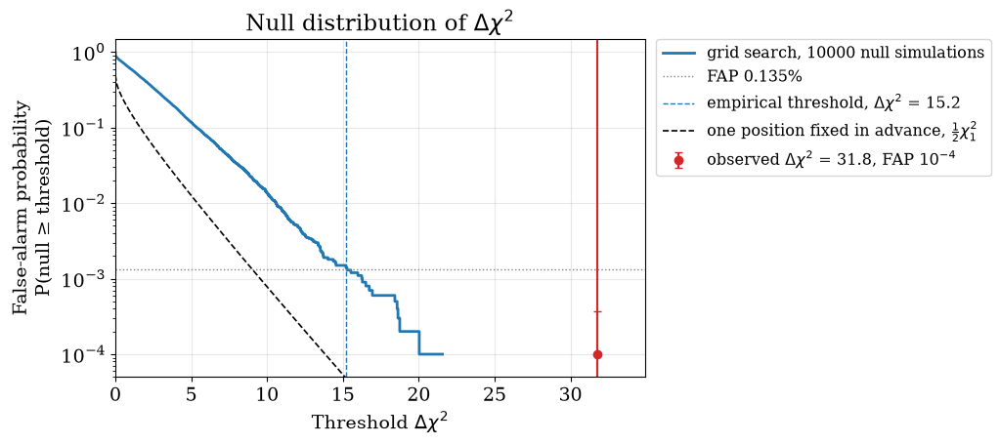
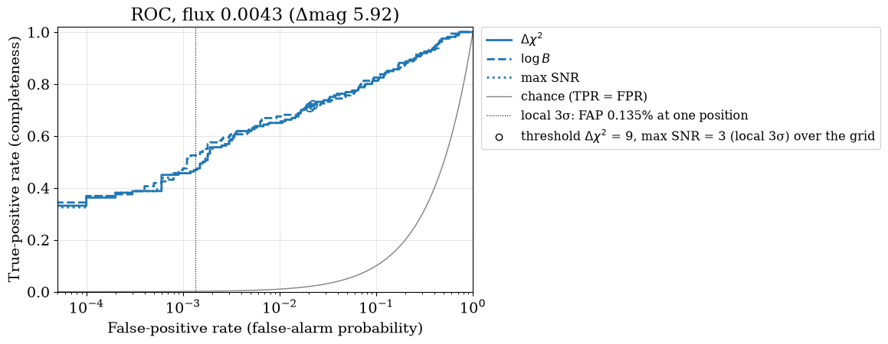
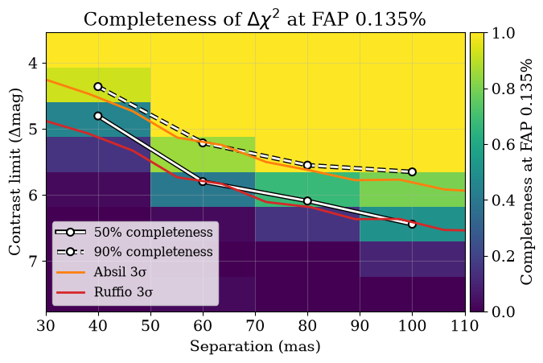

<!-- AUTO-GENERATED FROM notebooks/detection_roc.ipynb by scripts/sync_tutorial_docs.py. -->
# Detection ROC curves

You run a companion search over a grid of positions and fluxes, and it returns a best candidate with a $\Delta\chi^2$ of, say, 20. Is it real? And if the search finds nothing convincing, how faint a companion could it have found? Both questions have a frequentist answer that you can compute by simulation for your own observation and search grid, and this page shows how, with [`virgil.detection`](api/detection.md).

Three terms carry the whole page. The **false-alarm probability (FAP)** of a threshold is the fraction of companion-free observations in which the search would still return a statistic at or above that threshold. For a detection, the FAP of the observed value is the probability that noise alone would have produced a candidate at least as strong somewhere on the grid: it is the p-value of the search. The **completeness**, also called the true-positive rate, is the fraction of real companions of a given flux and separation that the search finds above the threshold. A **ROC curve** (receiver operating characteristic) plots completeness against FAP as the threshold slides from strict to loose: a strict threshold gives few false alarms but misses faint companions, a loose one finds more companions but also more false alarms, and the curve shows the whole trade-off at once.

You should come away with three things. First, the look-elsewhere effect: Wilks's theorem, which turns $\Delta\chi^2$ into a significance, is right for one position chosen in advance, but the best of hundreds of positions is much larger than any one of them, so a search must take its detection threshold from simulations of companion-free data over the same grid. Second, what to quote for a detection: the empirical FAP of the observed statistic, with its uncertainty. Third, what to quote for a non-detection: the contrast at which the search is 50% and 90% complete at a stated FAP, next to the Absil and Ruffio limits of the [contrast limits](contrast_limits.md) tutorial.

## Setup

We simulate the 7-hole NIRISS aperture mask at 4.3 µm with [`nrm_oidata`](api/coverage.md#virgil.coverage.nrm_oidata), which gives 21 squared visibilities with errors of 0.01 and 35 closure phases with errors of 0.5°. Its longest baseline is about 5.3 m, so its resolution $\lambda/B$ is about 170 mas. The star is a point source, so the scene without a companion, which we call the **null scene**, is a `BinaryModelCartesian` with companion flux zero. That is also the null hypothesis that every statistic on this page tests: the companion model with its flux set to zero.

The search grid covers ±120 mas in both coordinates in steps of 16 mas, about $\lambda/(10B)$. That is fine enough that a companion lying between grid points loses at most a few per cent of its $\Delta\chi^2$ and is found close to its true position; a much coarser grid can place a companion's best match on the wrong grid point. The even number of points keeps the star's own position, where a companion cannot be told apart from the star, off the grid. The flux axis has 32 values spaced logarithmically from $3\times10^{-4}$ to $3\times10^{-2}$ (fluxes are always companion/primary). It plays two roles: it seeds the optimizer that refines the best flux at each position, and it is the prior of the log Bayes factor, which is then uniform in log flux between its ends. Finally we fix the FAP at which we will claim a detection: 0.135%, the one-sided Gaussian tail at 3σ. It is one-sided because a companion's flux cannot be negative, so only upward fluctuations count; the often quoted 0.27% is the two-sided value.

```python
import time

import jax
import jax.numpy as jnp
import numpy as onp
from scipy import stats

from virgil.coverage import nrm_oidata
from virgil.detection import (
    detection_statistics,
    gaussian_null,
    injection_grid,
    injection_recovery,
    local_nsigma,
    rescale_errors,
)
from virgil.grid_fit import laplace_flux_uncertainty_grid, optimized_flux_grid
from virgil.limits import absil_limits, flux_to_delta_mag, ruffio_upperlimit
from virgil.models import BinaryModelCartesian
from virgil.plotting import (
    plot_completeness,
    plot_contrast_curve,
    plot_null_distribution,
    plot_roc,
    set_style,
)

set_style()  # the figure style used throughout the docs

template = nrm_oidata()  # 21 V² and 35 closure phases, no values yet
null_scene = BinaryModelCartesian(dra=0.0, ddec=0.0, flux=0.0)  # star alone
grid = {
    "dra": jnp.linspace(-120.0, 120.0, 16),  # mas, steps of 16 mas
    "ddec": jnp.linspace(-120.0, 120.0, 16),
    "flux": jnp.geomspace(3e-4, 3e-2, 32),
}
FAP = stats.norm.sf(3.0)  # 0.135%: the one-sided tail at 3 sigma

print(
    f"{template.vis.size} V² and {template.phi.size} closure phases; "
    f"{grid['dra'].size * grid['ddec'].size} positions × "
    f"{grid['flux'].size} fluxes; FAP = {FAP:.3%}"
)
```

```text
21 V² and 35 closure phases; 256 positions × 32 fluxes; FAP = 0.135%
```

## A candidate

Here is the observation we want to judge. We simulate it with a companion of flux $5\times10^{-3}$ (Δmag 5.75) at 70 mas and position angle 60°, plus noise drawn from the errors, and search it with [`detection_statistics`](api/detection.md#virgil.detection.detection_statistics). The search returns the best companion's position and flux and three statistics, each measuring how strongly the data prefer a companion to none. $\Delta\chi^2$ is twice the gain in log likelihood of the best companion on the grid over no companion, with its flux refined and constrained to be non-negative. The log Bayes factor $\log B$ is the natural log of the likelihood ratio averaged over the grid, an evidence for "a companion somewhere on the grid" against "no companion". The maximum SNR is the largest best-fit flux divided by its uncertainty, over positions.

[`local_nsigma`](api/detection.md#virgil.detection.local_nsigma) converts $\Delta\chi^2$ into a significance with Wilks's theorem. It is a **local** significance: the one the candidate would have if we had looked at that single position only, decided before seeing the data.

The output compares the best position with the truth. Expect them to differ by a grid step or two even on a fine grid: at an SNR of about 5, noise moves the likelihood peak by roughly the resolution divided by the SNR, some 30 mas for this mask, while the flux is recovered more closely.

```python
truth = BinaryModelCartesian(dra=60.6, ddec=35.0, flux=5e-3)  # 70 mas, PA 60°
observed = template.with_model(truth, key=jax.random.PRNGKey(2026))
obs = detection_statistics(observed, BinaryModelCartesian, grid)

print(
    f"best companion at ΔRA = {float(obs['dra']):.0f} mas, "
    f"ΔDec = {float(obs['ddec']):.0f} mas, flux = {float(obs['flux']):.2e} "
    f"(truth: 60.6 mas, 35.0 mas, 5.00e-03)\n"
    f"Δχ² = {float(obs['delta_chi2']):.1f} "
    f"(local significance {float(local_nsigma(obs['delta_chi2'])):.1f}σ), "
    f"log B = {float(obs['log_bayes_factor']):.1f}, "
    f"max SNR = {float(obs['max_snr']):.1f}"
)
```

```text
best companion at ΔRA = 88 mas, ΔDec = 40 mas, flux = 4.85e-03 (truth: 60.6 mas, 35.0 mas, 5.00e-03)
Δχ² = 31.8 (local significance 5.6σ), log B = 11.0, max SNR = 5.6
```

## Simulating the search

To learn how often noise alone gives a $\Delta\chi^2$ that large, and how often a real companion is found, we repeat the whole search on simulated observations. [`injection_recovery`](api/detection.md#virgil.detection.injection_recovery) does this in one call. It simulates `n_null` companion-free observations, the **null draws**, with Gaussian noise from the template's errors ([`gaussian_null`](api/detection.md#virgil.detection.gaussian_null)). It also simulates one observation per companion in `injections`, here laid out by [`injection_grid`](api/detection.md#virgil.detection.injection_grid): 4 separations from 40 to 100 mas times 8 fluxes from $10^{-3}$ to $3\times10^{-2}$, each at 40 random position angles. Every simulation is searched exactly as the real data were, by one compiled function, and the result is a [`DetectionMC`](api/detection.md#virgil.detection.DetectionMC), a plain NumPy container from which everything below is computed.

We use 10,000 null draws, so that about 13 of them lie above the 0.135% threshold and pin it down; `draw_batch=8` searches eight simulations at once, which is faster on a CPU. A larger run can be split over cluster array jobs with different seeds: `save` each result and merge them with `DetectionMC.concatenate`.

```python
FLUXES = onp.geomspace(1e-3, 3e-2, 8)
injections = injection_grid([40.0, 60.0, 80.0, 100.0], FLUXES, n_pa=40, key=1)

start = time.perf_counter()
mc = injection_recovery(
    template,
    null_scene,
    BinaryModelCartesian,
    grid,
    key=0,
    n_null=10_000,
    injections=injections,
    draw_batch=8,
)
print(
    f"{mc.n_null} null and {mc.n_injected} injected searches "
    f"in {time.perf_counter() - start:.0f} s"
)
```

```text
injection_recovery:   0%|          | 0/177 [00:00<?, ?it/s]
```

```text
10000 null and 1280 injected searches in 853 s
```

## The look-elsewhere effect

The plot shows, for every threshold on the x-axis, the fraction of the 10,000 companion-free searches whose $\Delta\chi^2$ reached it: the false-alarm probability of that threshold. The dashed black curve is what Wilks's theorem predicts at a single position fixed in advance. There, $\Delta\chi^2$ is zero half the time (whenever the best flux would be negative) and follows $\chi^2_1$ otherwise, so the FAP of a threshold is $\frac{1}{2}P(\chi^2_1 \geq \Delta\chi^2)$.

The grid search's curve lies far above it. Each of the 256 positions is a fresh chance for noise to mimic a companion, and the search reports the best of them, which is larger than any single one; neighbouring positions are correlated, so the effect is smaller than 256 independent tries would give, but still large. The dotted horizontal line is our FAP of 0.135%. Wilks's curve crosses it at $\Delta\chi^2 = 9$, the local 3σ, while the simulations cross it at the much higher empirical threshold, the dashed blue line. The red point is our candidate: its $\Delta\chi^2$, and its FAP with a 95% interval.

```python
plot_null_distribution(
    mc, "delta_chi2", observed=obs["delta_chi2"], fap=FAP
);
```



## What to quote for a detection

Now the numbers behind the plot. [`threshold`](api/detection.md#virgil.detection.DetectionMC.threshold) gives the $\Delta\chi^2$ that 0.135% of the null searches exceed, with a bootstrap error from the finite number of draws. [`false_alarm_probability`](api/detection.md#virgil.detection.DetectionMC.false_alarm_probability) gives the FAP of any value as $(k+1)/(n+1)$, where $k$ of the $n$ null draws reach it, with an exact binomial 95% interval. We print the FAP of Wilks's local 3σ threshold, which shows how optimistic the local significance is over a grid, and the FAP of the candidate. The candidate's FAP converts back to an equivalent **global** significance through the one-sided Gaussian tail: the significance of the search as a whole. If no null draw reaches the candidate, its FAP is only an upper limit, set by the number of draws, and its global significance a lower limit; more null draws would sharpen both.

For a detection, quote the observed $\Delta\chi^2$, its empirical FAP with the interval and the number of null draws, and the global significance it implies, and say what was simulated: the grid, the noise model and the errors. The local Wilks significance may be given too, but always labelled local.

```python
threshold, error = mc.threshold("delta_chi2", FAP)
wilks_fap = mc.false_alarm_probability("delta_chi2", 9.0)[0]
fap, low, high = mc.false_alarm_probability("delta_chi2", obs["delta_chi2"])
bound = "≥ " if low == 0.0 else ""  # no null draw reached the candidate

print(
    f"threshold at FAP {FAP:.3%}: Δχ² = {threshold:.1f} ± {error:.1f} "
    f"(Wilks, at one position: 9)\n"
    f"Wilks's Δχ² = 9 has an FAP of {wilks_fap:.1%} over the grid\n"
    f"candidate: Δχ² = {float(obs['delta_chi2']):.1f}, FAP = {fap:.2g} "
    f"(95%: {low:.2g} to {high:.2g}), global significance "
    f"{bound}{stats.norm.isf(fap):.1f}σ "
    f"(local {float(local_nsigma(obs['delta_chi2'])):.1f}σ)"
)
```

```text
threshold at FAP 0.135%: Δχ² = 15.2 ± 0.9 (Wilks, at one position: 9)
Wilks's Δχ² = 9 has an FAP of 2.2% over the grid
candidate: Δχ² = 31.8, FAP = 0.0001 (95%: 0 to 0.00037), global significance ≥ 3.7σ (local 5.6σ)
```

## ROC curves: which statistic?

Every simulation gives all three statistics, so their ROC curves can be compared fairly. We draw them for the injections of flux $4.3\times10^{-3}$ (Δmag 5.9), the fourth of our eight fluxes, at all four separations together. Read each curve as its threshold sliding from strict (lower left) to loose (upper right). The false-positive axis is logarithmic because detections are claimed at small FAPs, and on it the grey chance curve, TPR = FPR, which is what a statistic no better than a coin toss would give, is a curve rather than a straight line. The dotted vertical line is the FAP of 0.135% that Wilks's theorem assigns to a local 3σ, and the circle on each curve marks where its threshold actually equals a local 3σ ($\Delta\chi^2 = 9$, or an SNR of 3): the horizontal gap between the circle and the line is the look-elsewhere effect again. A ROC curve depends only on how a statistic ranks the simulations, not on its scale, which is why such different statistics can share one plot.

The $\Delta\chi^2$ and maximum-SNR curves practically coincide. For a faint companion the log likelihood is nearly quadratic in flux, so at each position $\Delta\chi^2 \approx \mathrm{SNR}^2$ whenever the best flux is positive, and both statistics pick the same best position; the maximum SNR is then close to $\sqrt{\Delta\chi^2}$, which ranks the simulations in the same order. The log Bayes factor averages the likelihood over all positions and fluxes instead of taking the best one, so it can rank them differently, and the plot shows whether that helps for this observation.

```python
plot_roc(
    mc, ["delta_chi2", "log_bayes_factor", "max_snr"], flux=FLUXES[3]
);
```



## What to quote for a non-detection

After a non-detection the question becomes what the search could have found. [`completeness`](api/detection.md#virgil.detection.DetectionMC.completeness) counts, for each injected separation and flux, the fraction of injections detected above the calibrated threshold, and [`contrast_curve`](api/detection.md#virgil.detection.DetectionMC.contrast_curve) interpolates in flux to the contrast at which that fraction reaches a chosen level. These are empirical contrast curves: at the 90% contrast, nine companions out of ten would have been detected at an FAP of 0.135%, look-elsewhere effect included. The table gives them in Δmag at each injected separation (NaN where the injected fluxes do not span that completeness).

```python
sep, flux50 = mc.contrast_curve("delta_chi2", FAP, completeness=0.5)
_, flux90 = mc.contrast_curve("delta_chi2", FAP, completeness=0.9)

print(f"Δmag reached at FAP {FAP:.3%}\nsep (mas)  50% complete  90% complete")
for s, f50, f90 in zip(sep, flux50, flux90):
    print(
        f"{s:9.0f}{float(flux_to_delta_mag(f50)):14.2f}"
        f"{float(flux_to_delta_mag(f90)):14.2f}"
    )
```

```text
Δmag reached at FAP 0.135%
sep (mas)  50% complete  90% complete
       40          4.81          4.36
       60          5.80          5.21
       80          6.09          5.55
      100          6.44          5.65
```

The map shows the completeness behind those curves, cell by cell, with the 50% and 90% curves drawn on it. Over it we draw the Absil and Ruffio limits of a companion-free observation, as in the [contrast limits](contrast_limits.md) tutorial; they answer different questions. Ruffio's limit, here at the 3σ-equivalent percentile, is a Bayesian upper limit on the flux at each position, given that a companion sits exactly there. Absil's limit, at 3σ, is the flux that a $\chi^2$ test against the no-companion model rejects at each position. Neither involves a detection threshold or the look-elsewhere effect, and each comes from one noise realisation, so it wanders with the noise, while the completeness curves average over many simulated observations. In this run the Absil limit happens to follow the 90% curve and the Ruffio limit the 50% curve, but with a single noise realisation that agreement is partly luck, and only the completeness curves carry a stated false-alarm probability. (`absil_limits` warns that it did not converge at two positions and clipped their limits; they do not affect the curves.)

For a non-detection, quote the 50% and 90% completeness contrasts at a stated FAP, for example "the search is 90% complete to Δmag X at 80 mas, at a false-alarm probability of 0.135%", together with the grid, the noise model and the number of injections. Absil or Ruffio limits can be given alongside, for comparison with the literature.

```python
blank = template.with_model(null_scene, key=jax.random.PRNGKey(7))
absil = absil_limits(blank, BinaryModelCartesian, grid, sigma=3.0)
best = optimized_flux_grid(blank, BinaryModelCartesian, grid)
sigma = laplace_flux_uncertainty_grid(blank, BinaryModelCartesian, grid, best)
ruffio = ruffio_upperlimit(best, sigma, stats.norm.cdf(3.0))

fig, ax = plot_completeness(mc, "delta_chi2", FAP)
for limit, label, color in [(absil, "Absil 3σ", "C1"), (ruffio, "Ruffio 3σ", "C3")]:
    plot_contrast_curve(limit, grid, label=label, color=color, band=False, ax=ax)
ax.legend(loc="lower left", fontsize="small");
```

```text
RuntimeWarning: absil_limits(): the optimizer did not converge at 2 of 256 grid positions; values there may be inaccurate.
RuntimeWarning: absil_limits(): 2 limits fell outside flux_bounds=(1e-06, 1.0) and were clipped; pass flux_bounds=None to keep them.
```



## When the error bars are wrong

Everything so far assumed that the errors are right, because the null draws were simulated from them. Suppose instead that the real noise is 1.5 times the quoted errors, which is common for calibrated interferometric data. The Gaussian null still simulates the quoted errors, so its threshold is too low, and the true FAP of that threshold, measured on 2000 simulations with the real noise, is far above the nominal value.

Two tools repair this. [`rescale_errors`](api/detection.md#virgil.detection.rescale_errors) estimates the factor from the data, scaling the errors so that the null scene has $\chi^2_r = 1$, separately for the V² and the closure phases; with the rescaled errors, the Gaussian calibration above is valid again. From a single observation the factors are themselves noisy estimates: 21 V² and the 15 independent closure phases of this mask pin each one down to roughly ±20%, so expect them to scatter about the true 1.5. [`bootstrap_null`](api/detection.md#virgil.detection.bootstrap_null) (`noise="bootstrap"`) does not trust the errors at all: it builds null draws by flipping the signs of the data's own whitened residuals about the null scene, so the draws carry the real noise. The table compares the threshold at an FAP of 1% (looser than 0.135%, so that 2000 draws measure it well) from honest errors, from wrong errors with a Gaussian null, and from wrong errors with a bootstrap null of one companion-free observation, each with the true FAP of its threshold.

```python
real_noise = gaussian_null(template, null_scene, error_scale=1.5)
bad = real_noise(jax.random.PRNGKey(11))  # companion-free, errors too small
truth_mc = injection_recovery(  # what the wrong errors really give
    template, null_scene, BinaryModelCartesian, grid, key=2,
    n_null=2000, noise=real_noise, draw_batch=8,
)
boot_mc = injection_recovery(  # calibrated on the data's own residuals
    bad, null_scene, BinaryModelCartesian, grid, key=3,
    n_null=2000, noise="bootstrap", draw_batch=8,
)
factors = rescale_errors(bad, null_scene)[1]

print(
    f"rescale_errors factors: V² {factors['vis']:.2f}, "
    f"closure phases {factors['phi']:.2f} (truth 1.5)\n"
    f"{'threshold at FAP 1% from':<36}{'Δχ²':>6}{'true FAP':>10}"
)
for label, calibration, actual in [
    ("honest errors, Gaussian null", mc, mc),
    ("errors 1.5× too small, Gaussian null", mc, truth_mc),
    ("errors 1.5× too small, bootstrap", boot_mc, truth_mc),
]:
    t = calibration.threshold("delta_chi2", 0.01)[0]
    p = actual.false_alarm_probability("delta_chi2", t)[0]
    print(f"{label:<36}{t:6.1f}{p:10.1%}")
```

```text
injection_recovery:   0%|          | 0/32 [00:00<?, ?it/s]
```

```text
injection_recovery:   0%|          | 0/32 [00:00<?, ?it/s]
```

```text
rescale_errors factors: V² 1.31, closure phases 1.78 (truth 1.5)
threshold at FAP 1% from               Δχ²  true FAP
honest errors, Gaussian null          10.6      1.0%
errors 1.5× too small, Gaussian null  10.6     14.5%
errors 1.5× too small, bootstrap      23.8      0.9%
```

## Summary

A companion search reports the best of many positions, so its statistic must be calibrated against simulated companion-free searches over the same grid; Wilks's theorem, through `local_nsigma`, gives only the local significance at one position, and over a grid it overstates the significance. `injection_recovery` runs the null and injected searches in one call, and its `DetectionMC` gives thresholds, false-alarm probabilities, ROC curves, completeness maps and contrast curves, which `plot_null_distribution`, `plot_roc` and `plot_completeness` draw.

For a **detection**, quote the observed $\Delta\chi^2$ with its empirical false-alarm probability, its 95% interval and the number of null draws, and the global significance that FAP implies; the Wilks significance only if labelled local. For a **non-detection**, quote the contrasts at which the search is 50% and 90% complete at a stated FAP (0.135%, the one-sided 3σ, is a common choice), with Absil or Ruffio limits alongside if you like.

Three caveats. The nuisance parameters, here the null scene itself, are held fixed at their values for the real data rather than refitted for every simulation. The grid must be fine enough that companions are found near their true positions, and the calibration holds only for the grid it was simulated on. And a Gaussian null is only as good as the error bars: if they may be wrong, rescale them with `rescale_errors` or calibrate with a residual bootstrap (`noise="bootstrap"`), keeping in mind that the bootstrap needs the null scene to fit the data. The design, its conventions and the remaining plans are in `design/detection_roc.md`.
